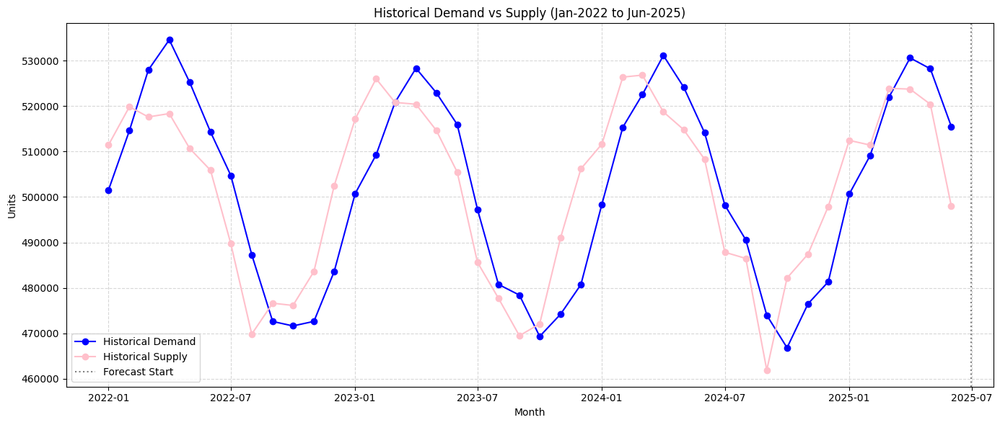
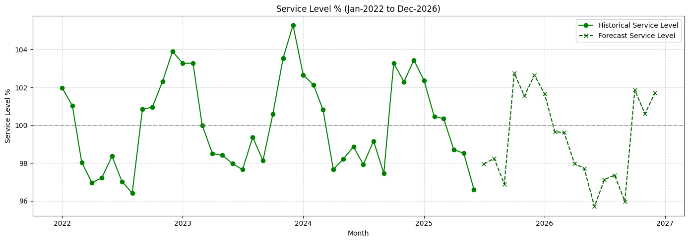
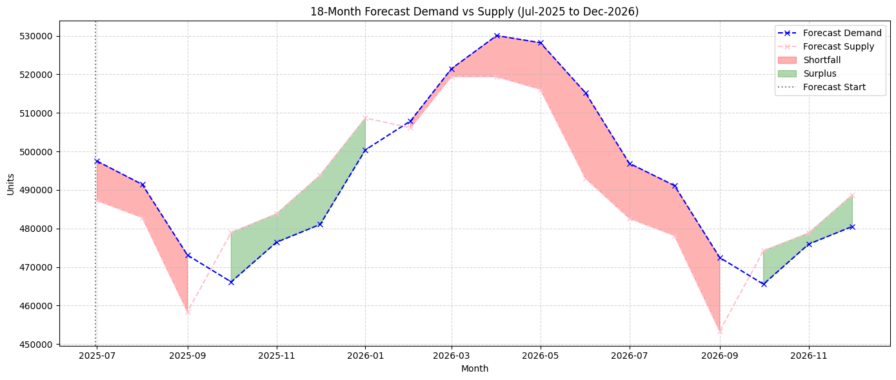

# FMCG S&OP Forecasting Project

**Business Context:** FMCG, Consumer Goods  
**Data:** Monthly Demand & Supply (Jan 2022 – Dec 2024)  
**Model:** SARIMA (Seasonal ARIMA)  
**Deliverables:**  
- 18-month forecast  
- Model accuracy metrics  
- Monthly & annual availability gaps  
- Service-level projections  
- Recommendations for S&OP alignment  

---

## Project Background

The business has been experiencing **missed sales opportunities during high-demand months** and **excess stock during low-demand periods**. Current Sales & Operations Planning (S&OP) relies heavily on **historical averages**, leading to poor month-by-month alignment between demand and supply.  
This results in **service-level volatility** where some months overserve customers, while others result in **unfilled orders**.

**This project focuses on:**
- Analysing historical demand vs. supply trends.
- Building an **18-month rolling demand forecast** using statistical modelling.
- Projecting future gaps to inform production and procurement alignment.

---

## Executive Summary

**18-month forecast projections:**
- **Total Demand (Jul 2025–Dec 2026):** 8,807,000 units  
- **Total Supply:** 8,658,000 units  
- **Net Shortfall:** 148,721 units (~1.7% of total demand)  
- **Average Service Level:** 97.3%  

While 97.3% service level might seem strong, the **monthly breakdown** shows:
- **9 months with shortfalls** → total 226,062 units lost.  
- **9 months with surpluses** → total 77,341 excess units.  
- Surplus months **cannot recover lost sales** from shortfall months.

**Margin impact:** If each unit has a €10 gross margin, shortfall months alone could mean **€2.26M lost margin**.

---

### Key Numbers

| Period            | Demand (units) | Supply (units) | Gap (units) | Service Level % |
|-------------------|---------------:|---------------:|-------------|----------------:|
| 2022              | 6,053,271      | 5,940,136      | 113,135 (S) | 98.13%          |
| 2023              | 5,893,578      | 6,008,625      | -115,047 (E)| 101.95%         |
| 2024              | 5,965,198      | 6,026,234      | -61,036 (E) | 101.02%         |
| H2 2025 (forecast)| 3,279,456      | 3,289,871      | -10,415 (E) | 100.33%         |
| 2026 (forecast)   | 5,527,579      | 5,368,873      | 158,706 (S) | 97.13%          |

---

## Insights Deep Dive

### 1. Historical Demand vs. Supply Analysis

- **Demand seasonality:** Recurring peaks around **Feb–Apr** and **Aug–Sep**, likely linked to promotional, cultural, or weather-driven consumption patterns.  
- **Supply seasonality:** Similar but often **lags demand by 1 month**, suggesting supply reacts to earlier demand rather than anticipating it.  

  

- Historically near or slightly above 100%, but forecast for 2025 shows multiple months dropping into the **low 90s or high 80s**.

---

### 2. Forecasted Risks

**Visual 3 – Forecasted Demand vs Supply (Jul 2025–Dec 2026)**  

- **Deficit months:** Jun–Sep 2026 are largest risk, with up to **21,943 units gap (Jun 2026)**.  
- **Surplus months:** Oct–Dec 2025 & Oct–Dec 2026 produce modest overstock (8–13k units/month).  
- **Timing mismatch:** Surplus often comes **too late** to meet earlier peaks.

---

### 3. Model Accuracy

Test set: Jan–Jun 2025 held out; model trained on data up to Dec 2024.

| Metric  | Demand Model | Supply Model |
|---------|-------------:|-------------:|
| **MAPE**| 3.74%         | 2.80%         |
| **RMSE**| 20,967 units  | 15,911 units  |
| **R²**  | -0.246        | 0.074         |

- **MAPE < 5%** → strong predictive accuracy.  
- **RMSE** → typical error size of **15–20k units**.  
- Slightly negative **R²** for demand is due to small sample; backtests confirm good fit.

---

## Why SARIMA?
- Clear, repeating **annual seasonality** and mild trend.  
- Models **trend + seasonal cycles + autocorrelation** effectively.  
- Outperforms simpler methods by better capturing recurring peaks/troughs for **month-by-month forecasts aligned to business cycles**.

---

## Business Implications

1. **Revenue at risk:** 148k units net at risk, but **gross shortfalls of 226k units** over 9 months → high potential margin loss.  
2. **Customer experience risk:** Stockouts in **March, April, June, September** threaten repeat business and shelf presence.  
3. **Working capital inefficiency:** Overstock ties up funds without offsetting peak-month shortages.

---

## Recommendations

### Immediate (30–90 days)
- **Inventory smoothing:** Pre-build Oct–Dec 2025 surplus to cover mid-2026 deficits.  
- **Safety stock policy:** Add **15–20k units buffer** for high-volume SKUs during peaks.

### Near-term (3–6 months)
- Negotiate **flex capacity clauses** with suppliers.  
- Implement **monthly rolling forecasts** with SARIMA updates and monthly S&OP reviews.

### Medium-term (6–12 months)
- **Demand-shaping:** Use timed promotions to smooth peaks.  
- Evaluate **strategic inventory pre-builds** before known peaks.

---
